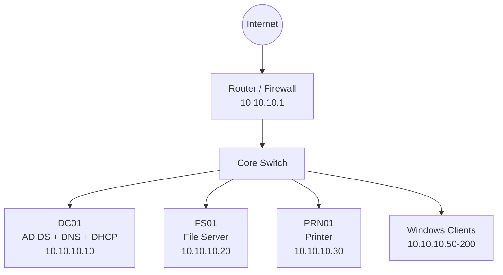

# Architecture

## Overview

The environment uses a single Active Directory domain named `contoso.local`. The domain controller hosts DNS and DHCP for a small branch office network.

## Logical Diagram



## IP Addressing

| Range | Purpose |
| --- | --- |
| 10.10.10.1 | Default gateway |
| 10.10.10.2-10.10.10.9 | Network devices |
| 10.10.10.10-10.10.10.29 | Servers |
| 10.10.10.30-10.10.10.49 | Printers, access points, reservations |
| 10.10.10.50-10.10.10.200 | DHCP client pool |
| 10.10.10.201-10.10.10.254 | Future expansion |

## DHCP Design

The DHCP server is authorized in Active Directory and provides:

- Scope: `10.10.10.50` through `10.10.10.200`
- Subnet mask: `255.255.255.0`
- Router option: `10.10.10.1`
- DNS server option: `10.10.10.10`
- DNS suffix option: `contoso.local`
- Lease duration: 8 days
- Reservations for printers and infrastructure devices

## DNS Design

DNS is Active Directory-integrated and hosted on `DC01`.

Zones:

- Forward lookup zone: `contoso.local`
- Reverse lookup zone: `10.10.10.in-addr.arpa`

Recommended DNS features:

- Secure dynamic updates
- Forwarders to trusted public DNS resolvers
- Aging and scavenging for stale records
- Reverse PTR records for servers and key devices

## GPO Design

GPOs are separated by purpose so that settings are easier to test, troubleshoot, and roll back.

| GPO | Target | Purpose |
| --- | --- | --- |
| CONTOSO - Computer Security Baseline | Workstation OU | Password, lockout, audit, firewall, and security options |
| CONTOSO - Workstation Configuration | Workstation OU | Windows Update, Control Panel, and desktop behavior |
| CONTOSO - User Environment | User OU | Drive mapping and user experience settings |

## Organizational Units

Recommended OU structure:

```text
contoso.local
├── Users
├── Workstations-Test
├── Workstations
├── Servers
├── Service Accounts
└── Groups
```

